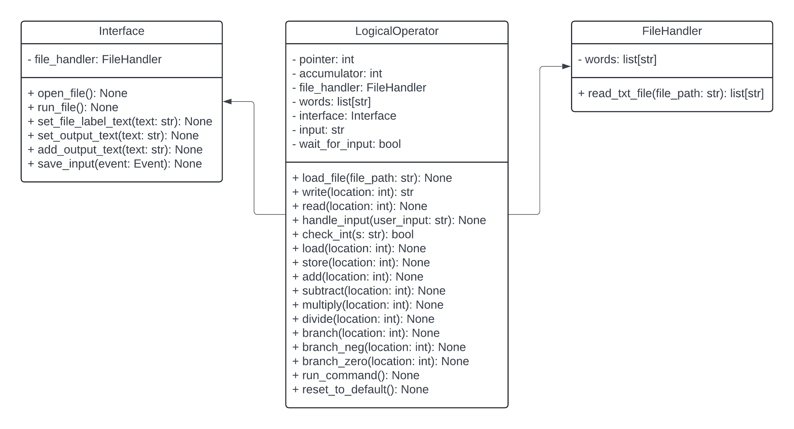

# Class Descriptions

## FileHandler Class

- **Purpose**

  - The `FileHandler` class is responsible for managing file input operations in the project. It ensures that the files are read and parsed correctly, and data is formatted properly.

- **Attributes**

  - `- words: list[str]`: Stores the lines of text read from files.

- **Methods**
  - `+ read_txt_file(file_path: str) -> list[str]`
    - **Purpose**: Reads a text file and returns its contents as a list of strings.
    - **Input Parameters**:
      - `file_path`: The path to the text file to read.
    - **Return Value**: A list of strings representing the contents of the file.
    - **Pre-conditions**: The specified file must exist.
    - **Post-conditions**: The file's contents are returned as a list.

---

## LogicalOperator Class

- **Purpose**

  - The `LogicalOperator` class handles the execution of all of the logic and operations of the project, including arithmetic computations and program control.

- **Attributes**

  - `- pointer: int`: Current instruction index.
  - `- accumulator: int`: Holds operation results.
  - `- file_handler: FileHandler`: Manages file operations.
  - `- words: list[str]`: List of program instructions.
  - `- interface: Interface`: Connects to the user interface.
  - `- input: str`: Holds user input for operations.
  - `- wait_for_input: bool`: Indicates if the program is waiting for user input.

- **Methods**

  - `+ load_file(file_path: str) -> None`

    - **Purpose**: Loads a specified file into the `words` list for execution.
    - **Input Parameters**:
      - `file_path`: Path to the text file to be loaded.
    - **Return Value**: None
    - **Pre-conditions**: The file must exist at the specified path.
    - **Post-conditions**: The file's contents are loaded into `words`.

  - `+ write(location: int) -> str`

    - **Purpose**: Writes the value from the accumulator to a specified memory location.
    - **Input Parameters**:
      - `location`: The memory location to write to.
    - **Return Value**: The value written.
    - **Pre-conditions**: `location` must be a valid index in the `words` list.
    - **Post-conditions**: The value in the accumulator is stored at the specified location.

  - `+ read(location: int) -> None`

    - **Purpose**: Reads input from the user and stores it in the specified memory location.
    - **Input Parameters**:
      - `location`: The memory location to store the user input.
    - **Return Value**: None
    - **Pre-conditions**: `location` must be a valid index in the `words` list.
    - **Post-conditions**: User input is stored at the specified location.

  - `+ handle_input(user_input: str) -> None`

    - **Purpose**: Processes user input for program execution.
    - **Input Parameters**:
      - `user_input`: The input string from the user.
    - **Return Value**: None
    - **Pre-conditions**: `user_input` should be a valid command.
    - **Post-conditions**: Input is processed for further actions.

  - `+ check_int(s: str) -> bool`

    - **Purpose**: Checks if a string can be converted to an integer.
    - **Input Parameters**:
      - `s`: The string to check.
    - **Return Value**: `True` if the string is a valid integer, otherwise `False`.
    - **Pre-conditions**: None
    - **Post-conditions**: None.

  - `+ load(location: int) -> None`

    - **Purpose**: Loads a value from the specified memory location into the accumulator.
    - **Input Parameters**:
      - `location`: The memory location to load from.
    - **Return Value**: None
    - **Pre-conditions**: `location` must be a valid index in the `words` list.
    - **Post-conditions**: The accumulator is updated with the value from the specified location.

  - `+ store(location: int) -> None`

    - **Purpose**: Stores the current value of the accumulator into the specified memory location.
    - **Input Parameters**:
      - `location`: The memory location to store the value in.
    - **Return Value**: None
    - **Pre-conditions**: `location` must be a valid index in the `words` list.
    - **Post-conditions**: The value in the accumulator is stored at the specified location.

  - `+ add(location: int) -> None`

    - **Purpose**: Adds the value from the specified memory location to the accumulator.
    - **Input Parameters**:
      - `location`: The memory location to add from.
    - **Return Value**: None
    - **Pre-conditions**: `location` must be a valid index in the `words` list.
    - **Post-conditions**: The accumulator is updated with the sum.

  - `+ subtract(location: int) -> None`

    - **Purpose**: Subtracts the value from the specified memory location from the accumulator.
    - **Input Parameters**:
      - `location`: The memory location to subtract from.
    - **Return Value**: None
    - **Pre-conditions**: `location` must be a valid index in the `words` list.
    - **Post-conditions**: The accumulator is updated with the difference.

  - `+ multiply(location: int) -> None`

    - **Purpose**: Multiplies the accumulator by the value in the specified memory location.
    - **Input Parameters**:
      - `location`: The memory location to multiply with.
    - **Return Value**: None
    - **Pre-conditions**: `location` must be a valid index in the `words` list.
    - **Post-conditions**: The accumulator is updated with the product.

  - `+ divide(location: int) -> None`

    - **Purpose**: Divides the accumulator by the value in the specified memory location.
    - **Input Parameters**:
      - `location`: The memory location to divide by.
    - **Return Value**: None
    - **Pre-conditions**: `location` must be a valid index in the `words` list, and the value must not be zero.
    - **Post-conditions**: The accumulator is updated with the quotient.

  - `+ branch(location: int) -> None`

    - **Purpose**: Changes the program flow to the specified instruction location.
    - **Input Parameters**:
      - `location`: The instruction index to jump to.
    - **Return Value**: None
    - **Pre-conditions**: `location` must be a valid index in the `words` list.
    - **Post-conditions**: The pointer is updated to the new location.

  - `+ branch_neg(location: int) -> None`

    - **Purpose**: Branches to the specified location if the accumulator is negative.
    - **Input Parameters**:
      - `location`: The instruction index to jump to if negative.
    - **Return Value**: None
    - **Pre-conditions**: `location` must be a valid index in the `words` list.
    - **Post-conditions**: The pointer is updated based on the accumulator's value.

  - `+ branch_zero(location: int) -> None`

    - **Purpose**: Branches to the specified location if the accumulator is zero.
    - **Input Parameters**:
      - `location`: The instruction index to jump to if zero.
    - **Return Value**: None
    - **Pre-conditions**: `location` must be a valid index in the `words` list.
    - **Post-conditions**: The pointer is updated based on the accumulator's value.

  - `+ run_command() -> None`

    - **Purpose**: Executes the current command pointed to by the pointer.
    - **Input Parameters**: None
    - **Return Value**: None
    - **Pre-conditions**: The current pointer must be valid.
    - **Post-conditions**: The pointer may be updated based on the command executed.

  - `+ reset_to_default() -> None`
    - **Purpose**: Resets the `LogicalOperator` attributes to their default state.
    - **Input Parameters**: None
    - **Return Value**: None
    - **Pre-conditions**: None
    - **Post-conditions**: All attributes are reset to their initial values.

---

## Interface Class

- **Purpose**

  - The `Interface` class manages the user experience and interaction, and displays output to the user. It connects the GUI to the underlying logic of the project.

- **Attributes**
  - `- file_handler: FileHandler`: Handles file-related operations.
- **Methods**

  - `+ open_file() -> None`

    - **Purpose**: Opens a file dialog to select a file for input.
    - **Input Parameters**: None
    - **Return Value**: None
    - **Pre-conditions**: None
    - **Post-conditions**: Selected file is passed to the `FileHandler`.

  - `+ display_output(output: str) -> None`

    - **Purpose**: Displays the given output string in the GUI.
    - **Input Parameters**:
      - `output`: The string to display.
    - **Return Value**: None
    - **Pre-conditions**: None
    - **Post-conditions**: The output is shown in the GUI.

  - `+ handle_user_input(user_input: str) -> None`
    - **Purpose**: Handles user input from the GUI.
    - **Input Parameters**:
      - `user_input`: The string input from the user.
    - **Return Value**: None
    - **Pre-conditions**: None
    - **Post-conditions**: User input is processed accordingly.

- **UML Diagram**:
  
